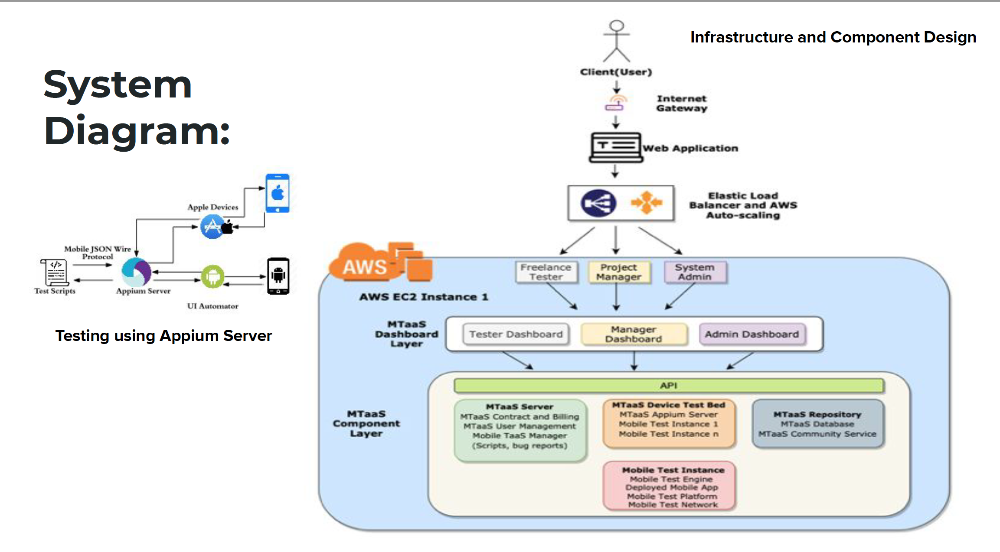
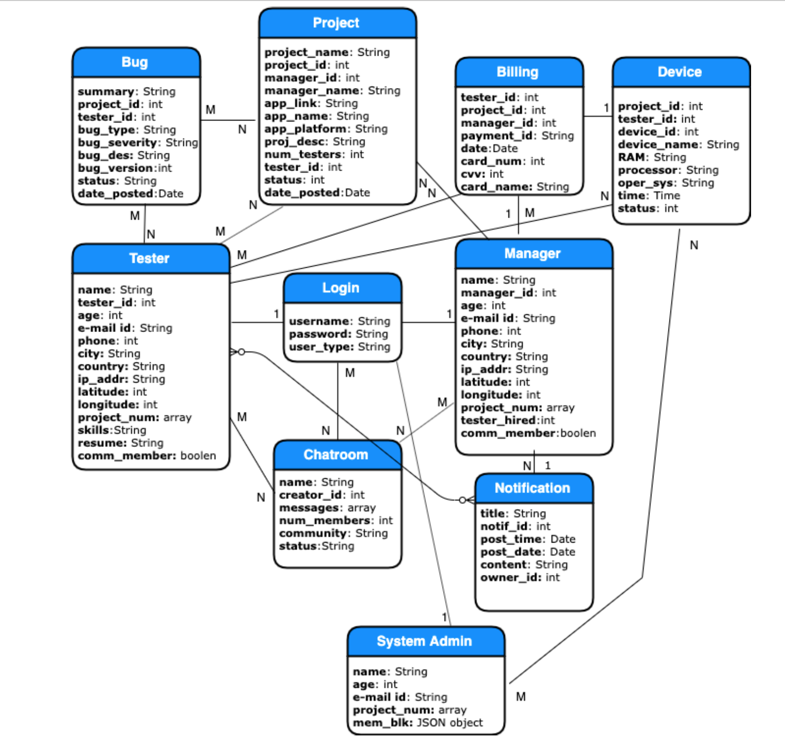
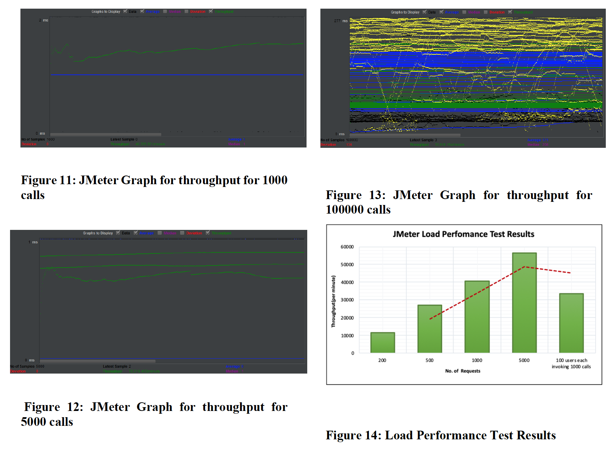
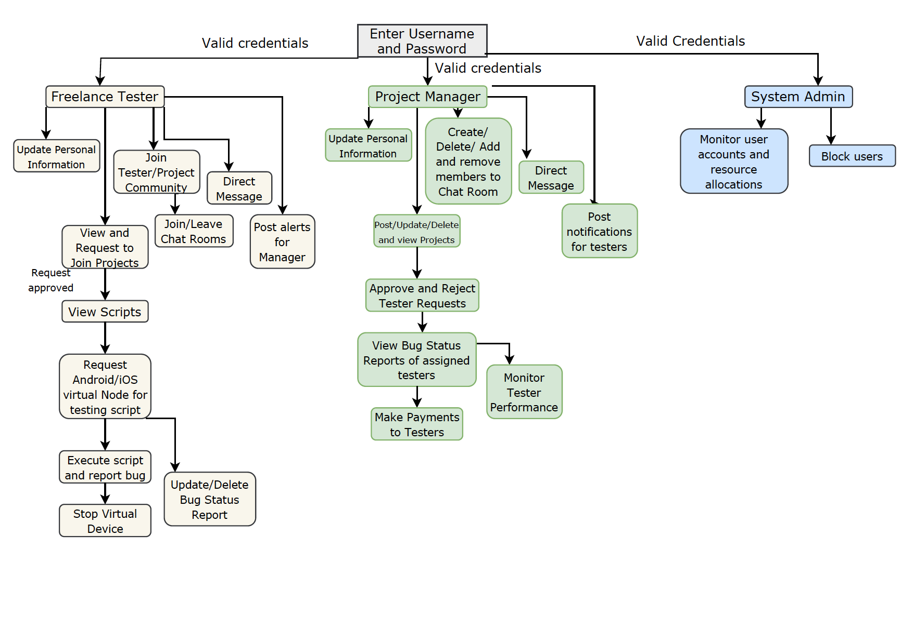

## Mobile Testing as a Service (MTaaS Platform)

### Introduction: 
This project discusses the comprehensive design, implementation and validation of the functional components of a crowd sourced mobile testing as a service platform. Elastic provisioning of mobile device emulators, running test scripts in cloud on Android Virtual Devices using Appium server, Tester and Project Management Community, Google map view of testers locations, cost metrics based on resource consumption and bug severity and PayPal and Chatkit Pusher Integrations are the salient features of our application.

### Objectives:
1) To build a scalable crowd based testing community that consists of project managers and crowd testers.
2) The administrator manages the infrastructures requirements such as hardware, network and bandwidth.
3) Tester and Project oriented Community services to facilitate communication and collaborative learning
4) To build an efficient payment metric for services used.

### Members:
1) Amit Kamboj- Mobile Test Project Management.
2) Nehal Sharma- Tester Oriented and Project Oriented Community Service, Chatkit Pusher(Chat Integration-3rd party), Google Maps API.
3) Pranjal Sharma- Tester Runner
4) Rachit Saxena- Crowd Sourced Tester Management

### System Diagram:

### Database Design Diagram:

### Application Performance Graphs:

### User Interface Function Partition Diagram:

